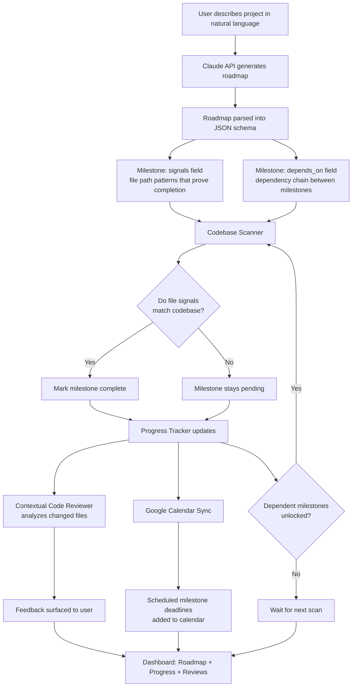

```mermaid
flowchart TD
    A[User describes project in natural language] --> B[Claude API generates roadmap]
    B --> C[Roadmap parsed into JSON schema]
    C --> D[Milestone: signals field<br/>file path patterns that prove completion]
    C --> E[Milestone: depends_on field<br/>dependency chain between milestones]

    D --> F[Codebase Scanner]
    E --> F
    F --> G{Do file signals<br/>match codebase?}

    G -->|Yes| H[Mark milestone complete]
    G -->|No| I[Milestone stays pending]

    H --> J[Progress Tracker updates]
    I --> J

    J --> K{Dependent milestones<br/>unlocked?}
    K -->|Yes| F
    K -->|No| L[Wait for next scan]

    J --> M[Contextual Code Reviewer<br/>analyzes changed files]
    M --> N[Feedback surfaced to user]

    J --> O[Google Calendar Sync]
    O --> P[Scheduled milestone deadlines<br/>added to calendar]

    N --> Q[Dashboard: Roadmap + Progress + Reviews]
    P --> Q
    L --> Q
```
